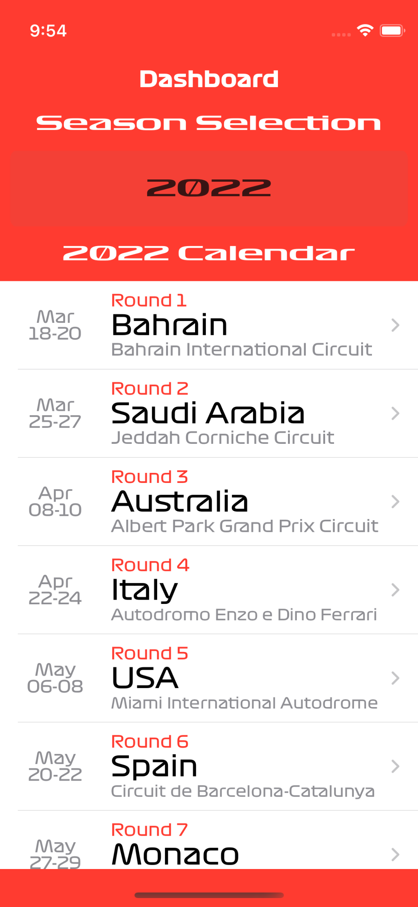
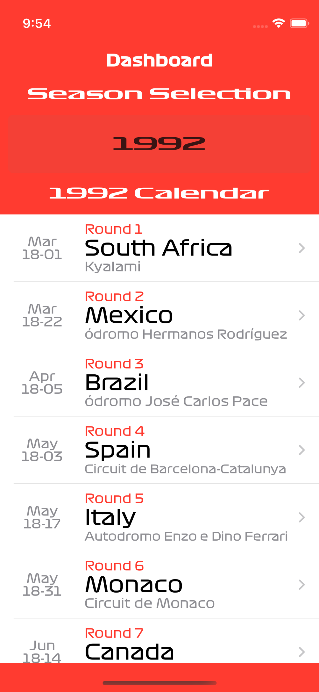
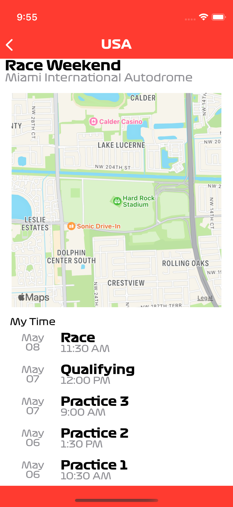

# F1CalendarApp

A simple UIKit application that uses the [ergast F1 API](https://ergast.com/mrd/) to display race calendars all the way back to 1950.
The application also features a race details screen which uses the longitude and latitude provided by ergast api to showcase the geolocation of events. And times as well. 

Credit to [QOAL](https://www.reddit.com/r/formula1/comments/8rpzq3/f1_font/) for the F1 font types. 

## Running Project
To run the application, simply clone the repository and run it on Xcode, depending what year is it, and the support given to the ergast API the lists may be empty.

## Application Architecture
The application is Model View Controller or MVC. There is one model the RaceEventsModel which exposes the internet request that fetches the race calendar data. The model also keeps track of
available seasons and the in memory version of the race calendar. 

The View Controllers simply poll the model for relevant data and display it accordingly. 

## Application Screenshots

